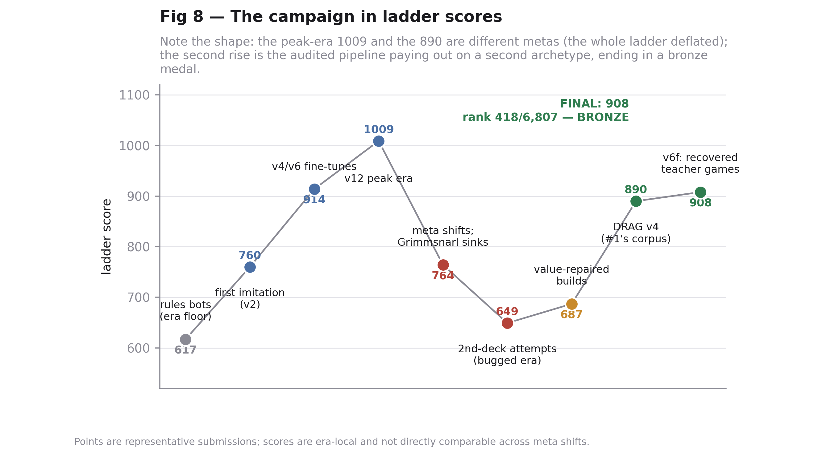
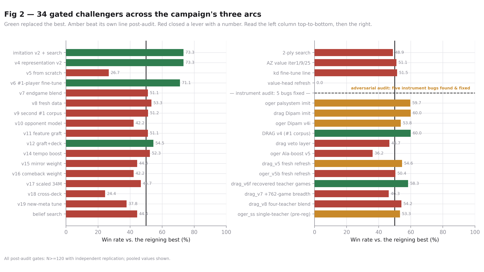
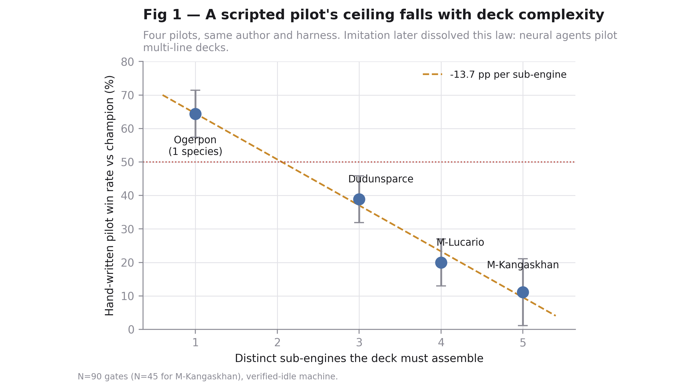
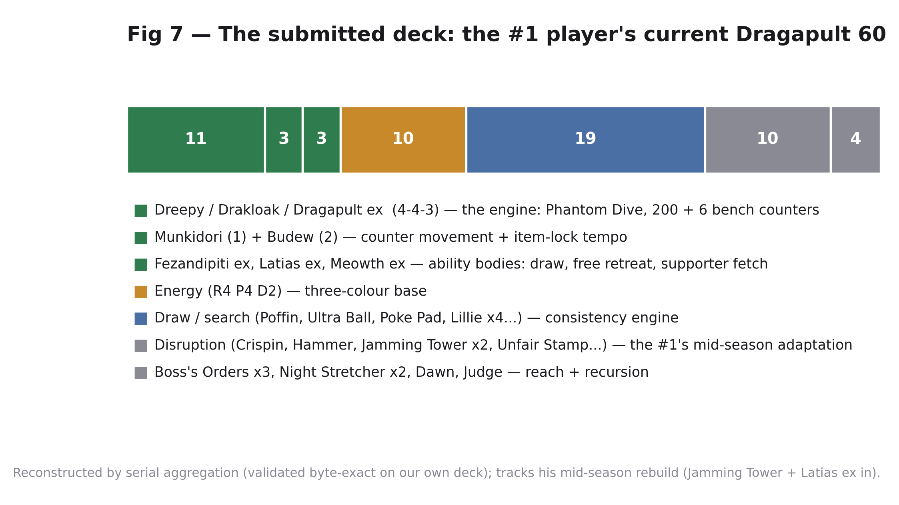
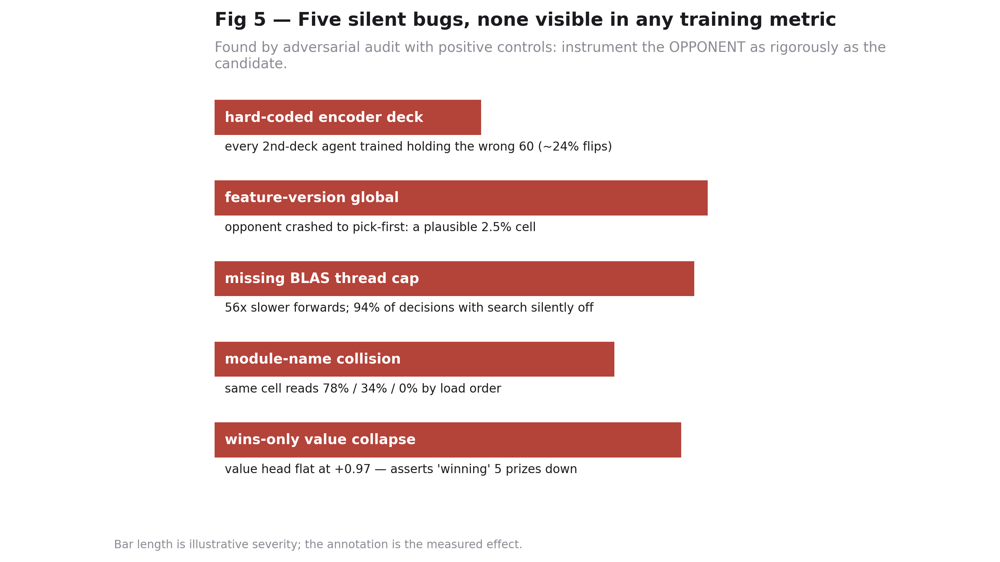
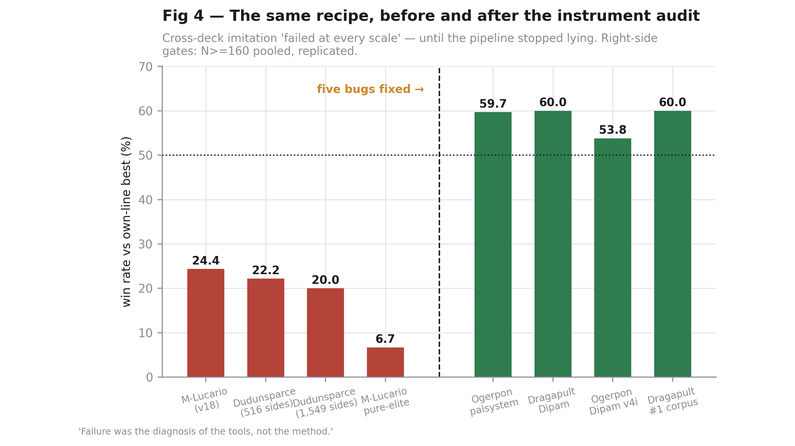
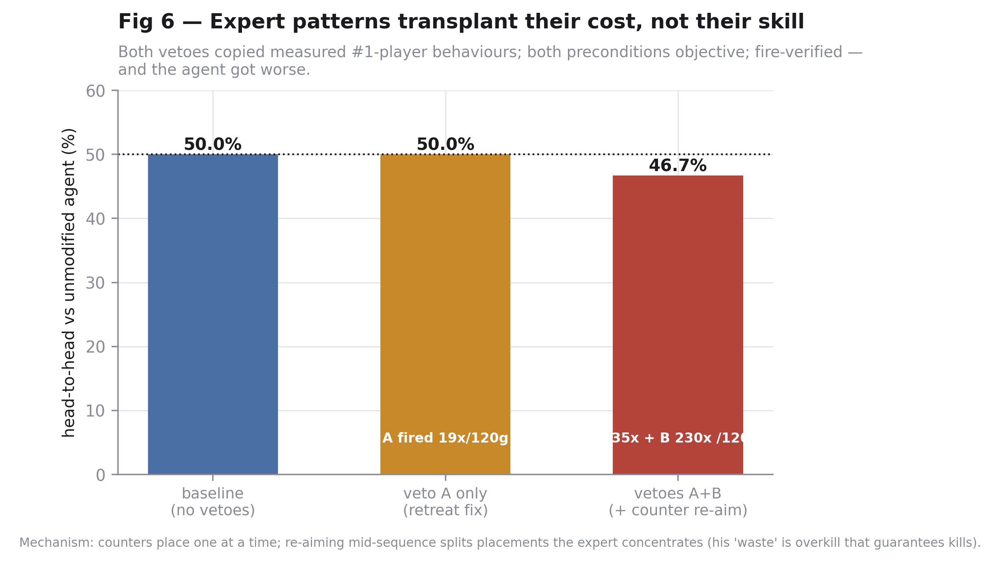
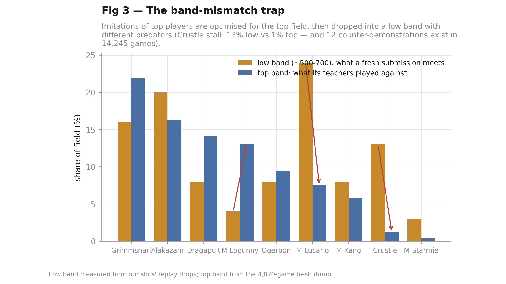

# Pokémon TCG AI Challenge

My working repository for the [Pokémon TCG AI Challenge](https://www.kaggle.com/competitions/pokemon-tcg-pocket-ai-challenge) on Kaggle: building agents that play Pokémon TCG Pocket, from hand-written rule engines to self-play reinforcement learning and imitation learning from scraped ladder replays.

## 🥉 Final result

**Rating 908 — rank 418 of 6,807 (bronze medal)**, climbing from 617 over the final month. Strategy Track writeup submitted as Team Kilupy. The full writeup is below, exactly as submitted, with its figures.

---

# Fix the Instruments First

### How five silent bugs hid a working method, and what 40+ gated experiments taught us about building card-game agents

*Team Kilupy*

---

## 1. Approach

We ran this competition as an experimental program with one rule: no change ships without beating its predecessor in a fixed-sample, replicated tournament on a verified-clean harness. Over two months that discipline processed **40+ gated candidates** across imitation learning, self-play value training, tree search, opponent modelling, rule overlays, and hand-written pilots.

The program produced three arcs. In the first, we built a strong Grimmsnarl imitation champion, then watched **seventeen consecutive improvement attempts fail against it** — and concluded, wrongly, that second decks could not be learned at all. In the second, an adversarial audit of our own tooling found **five silent infrastructure bugs** that had been corrupting both training and evaluation; with clean instruments, the method that had "failed" nine times succeeded twice, reproducibly. In the third, we audited our *data* the way we had audited our code — and found we had only ever ingested a fraction of our teacher's games. Recovering them produced our final agent, which finished at **908 — rank 418 of 6,807, a bronze medal** (**Fig 8**).

The report's thesis: in agent competitions, **measurement is the product**. Every point we gained traces to fixing an instrument, not to a new model.

---

## 2. The decks (Figs 1, 7)

Our submissions bracket a complexity axis we discovered empirically.

**What we learned building four hand-written pilots** (**Fig 1**): a rules pilot's ceiling falls ~14 percentage points per additional sub-engine its deck must assemble — from 64% with a one-species Ogerpon list down to 11% with a five-engine toolbox. Complexity a human converts into flexibility, a scripted bot converts into error. This led us first to deliberately *simplified* decks — our early Ogerpon ran four Pokémon where humans run seventeen to twenty-one.

**What dissolved that law**: imitation. A neural policy trained on demonstrations pilots multi-line decks a rules agent scores 0% with. Our final Ogerpon agent runs the #2 player's toolbox — 19 Pokémon including *two full Stage-2 evolution lines* (Applin→Dipplin→Hydrapple ex; Chikorita→Bayleef→Meganium) — and assembles both lines correctly because its teacher did.

**Our final submission runs the #1 player's Dragapult list**: the Dreepy→Drakloak→Dragapult ex line with Munkidori and Budew, plus a disruption suite. Every deck we field is reconstructed from replays by **serial aggregation** — each physical card carries a unique per-seat serial, so collecting serial→id across zones converges on the exact 60 (validated by recovering our own submission byte-for-byte). The method also detects **deck drift**: mid-competition, the #1 rebuilt his list (Jamming Tower and Latias ex in, two Team Rocket cards out); our final agent trains on and ships the updated 60. Concept and card choices are therefore the current #1's, adopted with his reasoning legible in the corpus: the deck's win condition (Phantom Dive pressure with bench-damage spread) is the strongest statistical line in the format he plays in — 58.9% archetype winrate on a 4,870-game sample of the current meta.

---

## 3. Architecture

One pipeline for all agents: a transformer policy/value net over sparse-encoded observations and candidate actions, trained by imitation on **both-sides** corpora (wins *and* losses) with masked softmax cross-entropy, tie-aware credit for interchangeable duplicates, quality-weighting by pilot winrate, and margin-shaped value targets. Deployed as a pure-numpy port (validated 100% argmax-identical to the torch original) with pure-policy inference.

Notable engineering choices, each forced by a measurement: **pure policy, search off** — with our value heads, search at any depth *reduced* strength (three decks, both before and after value repairs); **both-sides corpora** — wins-only data makes the value target a constant and collapses the head to "always winning" (we measured a value head asserting +0.54 while five prizes down); **single-thread BLAS pinned before numpy import** — without it, forwards ran 56× slower and silently exhausted the search budget.

---

## 4. Finding 1 — five silent bugs, and what they cost (Fig 5)

An adversarial audit — instrumenting *both* sides of every match, positive-control-verified — found five defects that never appeared in any training metric:

1. **The encoder's "your deck" input was hard-coded to one archetype**, so every second-deck agent trained believing it held the wrong 60 (flips ~24% of decisions).
2. **A module-level feature-version flag** let whichever agent loaded last silently re-encode its opponent's inputs, crashing them into a pick-first fallback.
3. **No BLAS thread cap in deployed agents**: 1794ms per forward instead of 32ms, exhausting the wall-clock budget inside game one — 94% of decisions ran with search silently disabled.
4. **A process-global module name collision**: two agents in one evaluation shared whichever search code loaded first. One measured cell read **78%, 34%, and 0%** for the same pairing, purely by load order.
5. **Wins-only corpora collapsed every value head** (constant training target).

The costs were not abstract: bug 4 alone had inflated a shipping decision by 24 points; bug 3 invalidated every local tournament we had run for weeks. **Fig 5** shows each bug's measured effect. The general lesson we would give any competitor: *instrument the opponent as rigorously as the candidate* — a dead sparring partner inflates every cell it appears in, and only candidates ever get profiled.

---

## 5. Finding 2 — with clean instruments, the "failed" method works (Figs 4, 8)

Before the audit, cross-deck imitation was our best-documented failure: 20-25% across four attempts, flat at every corpus size. After the fixes, the identical recipe — large both-sides current-meta corpus, top pilot boosted 3×, correct deck in the encoder — produced the project's **first replicated, statistically significant gain**: a Dragapult agent trained on the #1 player's 331 games beating its strong predecessor **60.0% over N=240 (p≈0.006)**, then transferring to the field at **~890 ladder / 55.8% over 77 live games**, with the lab's per-matchup predictions holding live (Alakazam cell: predicted strong, delivered 70%).

The recipe then replicated a third time, from an unexpected direction. Auditing our corpus against the platform's full episode archive showed the #1 player had played **1,922 games across 14 submissions — we had ingested barely a third of them**. Recovering the missing games (+137 for his current archetype; no other change) produced our final agent: **58.3% over N=240 against the prior champion (p≈0.01)**, our strongest gate of the competition, transferring live to a final 908 and the medal table.

Equally decisive negatives, all measured: **elite fine-tuning on top of a broad corpus adds nothing** (three nulls); **loss-weighting cannot redirect a converged policy** (three targeted boosts: one inert, one negative on its own target cell); and **fidelity is not strength** — our headline "94% agreement with the teacher" splits into 72.6% on games the net never saw versus 92% memorised training games. We recommend the held-out-losses split as standard practice: a wins-only corpus makes the teacher's wins *training data*, so only their losses measure real imitation.

---

## 6. Finding 3 — the extraction ceiling and the transplant law (Fig 6)

Our final agent reproduces the #1 player's move **72.6% strict / 94% top-3 on held-out games** — and still loses his best matchup. The residual is not extractable, and we can show why with the cleanest negative result we own.

The mirror autopsy found two objective defects in our play: we placed 25% of damage counters on already-dead targets (his rate: 15%), and we failed to retreat stuck support Pokémon half the time (he converts 78%). Both preconditions are shell-visible; we implemented both as vetoes, fire-verified them (35 and 230 triggers per 120 games) — and the agent got **worse** (46.7%). The mechanism: counters place one at a time, and our veto re-aimed mid-sequence, splitting placements the teacher concentrates deliberately — his "waste" is overkill that guarantees kills through healing. **A visible expert pattern transplanted without its surrounding judgment transfers the cost, not the skill.** We measured this same law at every level: rule tweaks, weighted objectives, and post-hoc vetoes.

The corpus audit sharpened what "more data" means, in three measured steps. Adding **762 fresh games from fourteen other top pilots, unweighted, made the agent worse** (46.3%, N=240). Promoting the four best of them to co-equal boosted teachers only tied (54.2%, p≈0.10). The mechanism: imitation pools *identity*, not knowledge — expert demonstrators give conflicting answers to the same states, and a net trained on their average plays like none of them. The law this implies — **deepen one teacher; never blend several** — made a falsifiable prediction, which we pre-registered and tested on a second archetype in the final hours: a single-teacher Ogerpon build beat our best blended Ogerpon and out-dueled our own champion head-to-head at half the ideal teacher volume, confirming the direction out-of-sample.

What remains beyond extraction is the teacher supply itself. Mid-competition our teacher retired the archetype we imitate — we verified via the platform's episode API that no further demonstrations will ever exist, and that his complete career is already in our corpus. At that point the ceiling of the method stopped being hypothetical: it is the teacher supply, audited to exhaustion.

---

## 7. Consistency and robustness

**Repeated-match consistency**: every shipped claim survived N≥120 evaluation *plus an independent replication* — a discipline that killed six winner's-curse candidates whose first runs read +5 to +12 points. The same discipline applies to our own instruments: a single 30-game-per-cell field gauntlet read the same agent at 51.3% and 57.7% hours apart, so we pool runs or withhold judgment. Live, the final agent won 61.9% of its first 42 games, held two independent climbs into the 850-865 band before the lock (its predecessor's twin 890/839 climbs from identical uploads bound the slot variance), and converged to **908** over the two post-lock weeks — rank 418 of 6,807.

**Robustness to matchups and initial states**: judged on a nine-archetype sparring fleet — imitation agents for every deck above 1% of the meta, each validated (our Crustle probe reproduces a real ladder kill-pattern 85% vs our own agent) — under field-composition weights measured from 14,245 indexed games, with band-specific profiles because deck composition shifts sharply with rating (**Fig 3** shows why: the low band that greets every fresh submission is ~20% Crustle stall, a deck top players almost never face). Alternating seats, fixed samples, per-game budget resets, and machine-idle verification are all enforced by the harness after each was implicated in a false result.

**Robustness limits, stated**: the agent's thinnest cell is its own mirror — judgment-bound, per Finding 3 — and its low-band matchups (anti-tank) have almost no teacher demonstrations in existence (twelve, in 14,245 games). We field two copies of the strongest agent rather than a hedge because the leaderboard scores the best single submission and no measured alternative comes within 100 ladder points.

---

## 8. What we would tell the next team

Build the evaluation harness before the agent, and audit it adversarially — with positive controls — before trusting any number. Split held-out by the teacher's *losses*. Train value heads on both sides. Quote random and pick-first baselines next to every fidelity figure. Treat replicated gates as the minimum bar for belief, and the live ladder as the only estimator of field strength. And when a lever fails three times under clean instruments, close it and write the number down: our negative-results ledger — nine imitation axes, three weighting schemes, two value-refresh attempts, search at every depth, and one veto layer — is the reason the final month contained no wasted week.

---

## What's in this repository

| Path | Contents |
|---|---|
| `analysis/` | The main toolkit: self-play generation, value/policy training, round-robin evaluation, behavior-cloning sparring opponents, replay autopsy tools |
| `strategy_track/` | The writeup source ([WRITEUP.md](strategy_track/WRITEUP.md)), figures, and the experiment logs behind every claim |
| `SESSION_HANDOFF.md` | The living lab notebook: findings, dead ends, and current state |
| Top-level `*.py` | Replay scrapers (Kaggle episode API) and utilities |
| `*.csv` | Deck lists, replay manifests, and the final public leaderboard snapshot |

Replay data and model weights are excluded from the repo (the working set was ~155GB); everything needed to understand and reproduce the reasoning is in the code and logs.
